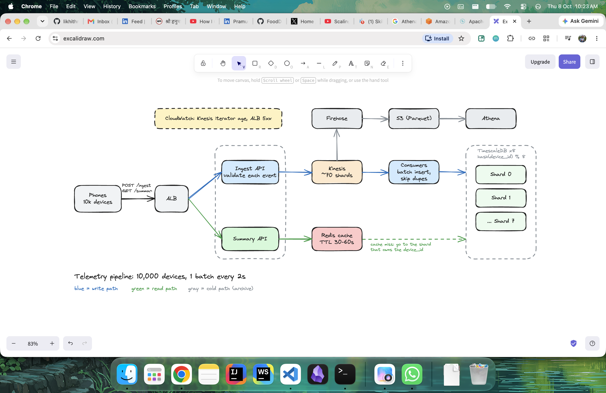
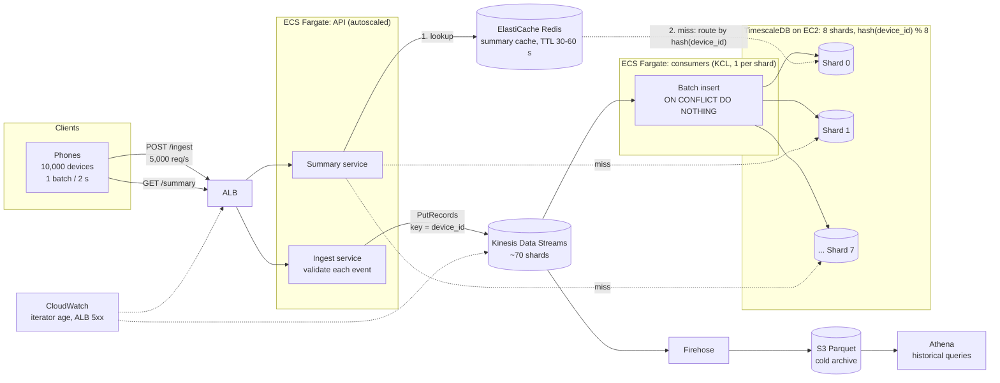

# System Design notes

## Description
Provided scenario page 1 of the backend engineer assignment, which explicitly states that system needs to recieve from the smartphones at a high frequency(10-50 events per second per device): GPS, accelerometer, and gyroscope readings. Your job is to build a minimal but correct ingestion + query service along how I decide to scale it

## Provided Information
1. Batching every 2s per device 
2. 10,000 devices support
3. 10-50 Hz sampling rate 
4. Batches of 1-500 events
5. No Auth, a single node is fine for the code, any language and database

## Assumptions
1. 10,000 is the stead-load not the peak
2. Every device streams continuously for 24 hours
3. 10-50 Hz sampling rate where I choose 30 Hz mid-point for a more realistic average
4. Event is about 100 bytes raw: 8 bytes for the timestamp, 72 for nine float64 values and 8 for the numeric device key, rounded up.

## Functional Requirements
1. The system should accept sensor data from a phone through a REST API (POST /api/v1/telemetry/ingest).
2. A request should contain one device_id and a list of 1 to 500 events.
3. Each event should have a timestamp, lat, lon, speed, accelerometer values (x, y, z) and gyroscope values (x, y, z).
4. The system should check every event on its own:
    - timestamp must be positive and not more than 24 hours in the future
    - lat must be between -90 and 90
    - lon must be between -180 and 180
    - speed must be between 0 and 300
    - accelerometer and gyroscope values must be numbers
5. Valid events should be saved, and invalid events should be rejected with their position (index) and the reason.
6. If the same device_id and timestamp come again, the system should not save it twice. It should count it as a duplicate.
7. The system should return 400 for the whole request if device_id is missing or empty, events is missing or empty, or there are more than 500 events.
8. The response should show accepted, duplicates, rejected and the list of errors.
9. The system should provide a summary API (GET /api/v1/telemetry/summary) that takes device_id, from and to.
10. The summary should return average speed, maximum acceleration and total event count for that time range (both from and to included).
If no events are found, it should return 200 with count 0 and null values.

## Non-functional requirements
1. Performance: the system should handle many requests per second (5,000 requests/s and up to 500,000 events/s in the design).
2. Fast queries: searching events of one device by time range should be fast, so the data is stored with an index on device_id and timestamp.
3. Reliability: if a phone sends the same batch again because of a network problem, the data should still be stored only once.
4. Concurrency: if two requests with the same event arrive at the same time, only one copy should be saved.
5. Scalability: the system should be able to grow by adding more servers when more devices join.
6. Availability: the system should stay up almost all the time, and it should not lose data when traffic suddenly increases.
7. Late data: events that arrive late should still be saved and show up in later queries.
8. Maintainability: the code should be clean and split into layers (API, service, storage), and it should have tests.
9. Easy setup: anyone should be able to run the project with simple steps from the README.
10. Security: login and authentication are not needed for this assignment, but a real system would need them.

## CAP Theorem Analysis
This application is depending on the timestamps that each device sends a batch of data every 2 seconds

Partition Tolerance becomes our number one  priority for this use case. Let me provide a classic example for this one.  A late event shows up in the later summaries, but not the ones that are already served. Plus in distributed syste,ms the partition tolerance isn't a choice, it's mandatory. That's a `classic AP trait(Availability - Partition Tolerance)`. A slightly stale summary is hence acceptable. The data is purely telemetry and not something like a bank balance where consistency is prioritized.

Why Availability ?

Assume there are lakhs of devices that keep sending you the telemetry data that are actually buffered in Kinesis(AWS) even if the database shard is unreachable, and let's say the consumers catch up afterwards. Hence I have concluded that availability must be prioritized.

```
Conclusion : This system is eventually consistent that prioritizes AP trait over the consistency
```
## Back-of-the envelope estimation
Each device sends 1 request every 2 seconds, so each device makes around:  
`1 device / 2 s = 0.5 requests/s`  
So for the whole fleet of 10,000 devices the RPS would be(steady-state load):  
`10,000 x 0.5 requests/s = 5000 requests/s`.  
So for the peak load assuming that peak load would be 5x-10x more than the steady-state load:  
`25,000 requests/s - 50,000 requests/s`

## How a device sends a reading
Hertz in physics is basically what we call times per second. 
So let's say the device measure how many times, holds the readings in the buffer, and sends the whole buffer event 2 seconds.

## Throughput and Storage
| | 10 Hz | **30 Hz (plan)** | 50 Hz |
|---|---|---|---|
| Requests/s (10,000 ÷ 2 s) | 5,000 | **5,000** | 5,000 |
| Events per batch (2 s × rate) | 20 | **60** | 100 |
| Events/s (10,000 × rate) | 100,000 | **300,000** | 500,000 |
| Events/day (× 86,400 s) | 8.6 B | **25.9 B** | 43.2 B |
| Raw storage/day (× 100 B) | 0.86 TB | **2.6 TB** | 4.3 TB |

**Database: TimescaleDB** (Postgres with time-series partitioning and compression). I'd keep Postgres semantics, because `ON CONFLICT` deduplication and SQL aggregates are exactly what the two endpoints need.

**Partitioning key:** time (1-hour chunks, about 170 GB each before compression) plus a hash of `device_id` into 16 partitions. A summary query for one device and a time window touches only the matching chunks. To spread writes across machines, I'd shard by `hash(device_id) % 8` at the consumer, which leaves about 37,000 rows/s per database.

**What breaks first without partitioning:** write throughput. One Postgres node handles roughly 50–100k rows/s with batching, and 300k is 3–6x that, with the WAL at around 50–100 MB/s. Second, deleting old data: 26 billion dead rows a day is more than vacuum can clear, while dropping a partition is instant.

## 2. Failures and Load Behaviour
### An event arrives 45 minutes late
The only timestamp rule is "not more than 24 hours in the future", so a late event is totally valid and is stored under its own event time, not its arrival time. It lands in the previous hour's TimescaleDB chunk, which is still uncompressed, so the insert is cheap. Summaries are computed from the table on every request, so the next summary for that window includes the event(showing inclusion). The one already served isn't recalculated, and a cached copy in Redis can hide the event for up to its 30–60 s TTL. In production I would make the Redis key include a per-device version number that the consumer would increment when it writes, so a late event invalidates the cached summaries for that device at once.

### The same batch is retried three times
An event's identity is `(device_id, timestamp)`, not the batch it arrived in, so a retry that is re-batched differently is still caught. The insert is `ON CONFLICT (device_id, ts) DO NOTHING`. The first request returns `accepted: N`; the second and third return `accepted: 0, duplicates: N` with HTTP 200, and the table still has N rows. A retry costs N index lookups and no writes. In the Kinesis design the API answers before the database write, so the consumer does the same `ON CONFLICT` insrt and silently skips the repeats, and the API reports the events as queued instead of counting database duplicates.

### Traffic increases 10x within one minute
That is 50,000 requests/s and about 3 million event/s. Autoscaling takes 1–3 minutes, so the first minute would actually run on existing capacity. The API only validates and writes to Kinesis, so each request is cheap, and it's best I keep 2x CPU space. Let's say a 10x spike (about 700 MB/s) is more than the 70 shards take, so some writes fail. Rather than queue until timeout, the API then would actuallty return `429` with `Retry-After`, and devices back off with jitter or even the exponential timeoff. This is safe because phones buffer readings locally. The extra backlog is about 9 × 300,000 × 60 s ≈ 162 million events. With datbases sized for 2x steady load (600,000 row/s), the spare 300,000 rows/s clears it in about 9 minutes, which I can monitor through Kinesis . 

## 3. AWS implementation

| Layer | Service | Why this and not the obvious alternative |
|---|---|---|
| Ingestion | **ALB → ECS Fargate** (Spring Boot, autoscaled) | An ALB is far cheaper than API Gateway at 5,000 req/s (about 13 billion requests/month), and I don't need API Gateway's features here. |
| Buffering | **Kinesis Data Streams**, partition key `device_id` | I need per-device ordering, replay, and two consumers (DB writer + archive); SQS deletes messages once consumed and its standard queues don't guarantee order. |
| Compute | **ECS consumers** (Kinesis Client Library), one per shard | Lambda would open a connection storm against Postgres; long-lived consumers pool connections and write in batches. |
| Hot storage | **TimescaleDB on EC2** (R6i which has the ratio of 8:1 memory to vCPU, supports upto 128 vCPUs per instance which is 33% more than R5 instances) | DynamoDB at 300k writes/s is about 300k WCU, and can't do average or max over a range; RDS/Aurora has one writer that can't take 300k rows/s; Timestream for LiveAnalytics is closed to new customers. |
| Cold storage | **Firehose → S3 (Parquet) → Athena** | Old data is read rarely, and S3 is far cheaper than keeping it in the database. |
| Monitoring | **CloudWatch** | Alarms on Kinesis `GetRecords.IteratorAgeMilliseconds` and ALB 5xx show when the pipeline falls behind. |

**Sizing the stream**: a 60-event batch is about 14 KB of JSON, so 5,000 req/s is about 70 MB/s. At 1 MB/s per shard that is about 70 shards, and about 700 at 10x. On-demand mode removes the shard math, but I'd confirm the quota first.

## High-level architecture
To be honest, I had already designed the diagram on my excalidraw and then asked AI to create the mermaid diagram for the same for better visual representation. Here is the diagram that I had jot down:




**Read path:** phone → ALB → Summary service → Redis. On a hit, return it. On a miss, query the one shard that owns the `device_id`, store the result in Redis with a TTL, and return it.


**Write path:** phone → ALB → Ingest service (validates, returns the per-event result) → Kinesis → consumer → TimescaleDB shard.
**Read path:** phone → ALB → Summary service → the one shard that owns that `device_id`.
**Cold path:** Kinesis → Firehose → S3 (Parquet) → Athena.


## 4. Kubernetes
Here the primary goal is to have the system up and running all the time which technically must have the EKS pods. A deployment would then run N replicas behind the ALB. A Horizontal Pod AutoScaler(HPA) adds the pods when the CPU requests per pod actually goes up. So this can handle the traffic spikes easily

A crashed pod is replaced automatically. The kinesis basically adds a checkpoint which means the new pod resumes where the old ones have stoped.
I could also have some rolling uodates with new version without downtime/ less downtime 

### Downtime Calculation
1 year = 365 days
according to the standard downtime formula:
```
allowed downtime = (1-availability) x period
```

so the caluclation would somehwat be like this:

```
let's assume the availbility we want would be 99.95%


so downtime = (1-0.9995) * 365 = 0.1825 days
0.1825 × 24             = 4.38 hours
4.38 × 60               = 262.8 minutes
262.8 × 60              = 15,768 seconds
```

| Availability | Per year | Per month | Per week | Per day |
|---|---|---|---|---|
| 99% | 87.6 h (3.65 days) | 7.2 h | 1.68 h (100.8 min) | 14.4 min |
| 99.9% | 8.76 h (31,536 s) | 43.2 min (2,592 s) | 10.08 min | 1.44 min (86.4 s) |
| **99.95%** | **4.38 h (15,768 s)** | **21.6 min (1,296 s)** | **5.04 min (302.4 s)** | **43.2 s** |
| 99.99% | 52.56 min (3,153.6 s) | 4.32 min (259.2 s) | 1.01 min (60.5 s) | 8.64 s |
| 99.999% | 5.26 min (315.4 s) | 25.9 s | 6.05 s | 0.86 s |


### Kinesis Sharding choice
Each device sends one batch every 2 seconds, so 10,000 devices means 5,000 requests a second. At 30 Hz a batch has about 60 events, which is roughly 14kb of Json. That works out to around 70 mb/s going into Kinesis. A shard takes 1 mb/s or 1,000 records a second on writes, whichever you hit first. On records I'd only need 5 shards, but on bandwidth I need about 70, so bandwidth is what decides it. If traffic goes up 10x, that's around 700 shards, and that's where I'd look at on-demand mode. I'm using device_id as the partition key, so each device's events stay in order, and with about 140 devices per shard there's no single hot key

One Postgres node can realistically take 50 to 100k rows a second with batching, and I'm planning for 300k, so I need to split the writes. I shard by hash of device_id mod 8, which brings each node down to about 37k rows a second. I picked device_id over time because the summary query always asks about one device, so it only ever hits one shard, and the duplicate check on device_id plus timestamp stays local to that shard. If I sharded by time, all the live writes would land on one node. Inside each node, TimescaleDB handles the time side with hourly chunks, so range queries are fast and dropping old data is instant.


Plain mod 8 isn't great for growth, because going to 9 nodes remaps most devices. In production I'd use consistent hashing or a lot of virtual shards mapped onto the nodes, so adding a node only moves a small slice of data.


Source :

[1] https://aws.amazon.com/ec2/instance-types/r6i/

[2] https://docs.aws.amazon.com/AmazonECS/latest/developerguide/AWS_Fargate.html

[3] https://www.confluent.io/compare/kafka-vs-kinesis/

[4] https://docs.aws.amazon.com/streams/latest/dev/introduction.html

[5] https://rathi-ankit.medium.com/kinesis-data-streams-vs-kinesis-firehose-7603afd00261

[6] System Design Interview Vol.1 & Vol.2 (Book)
